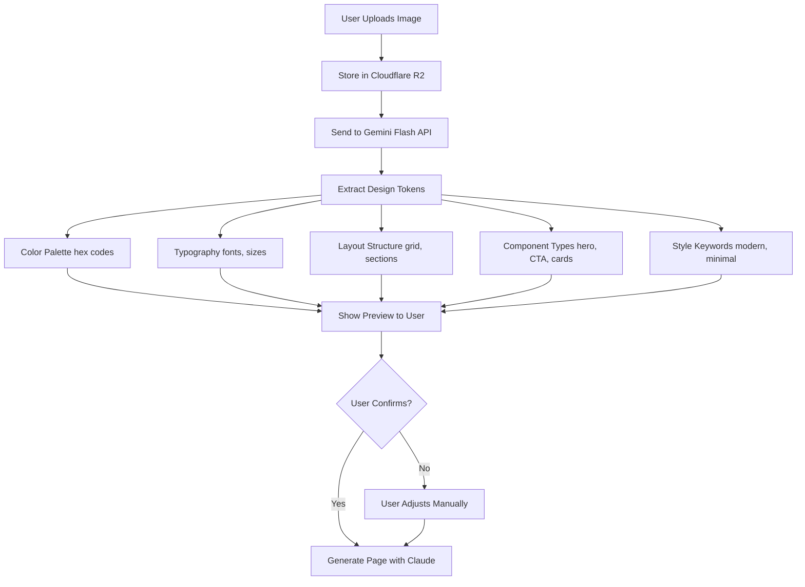

# AI Strategy Details - Bubble Gum

**Version:** 2.0.0
**Last Updated:** November 03, 2025
**Status:** Production Ready
**Purpose:** Complete AI implementation guide for Bubble Gum page builder

---

## Table of Contents

1. [API Keys Model (Hybrid Approach)](#api-keys-model-hybrid-approach)
2. [Security for API Keys](#security-for-api-keys)
3. [Multi-Model Strategy](#multi-model-strategy)
4. [Model Configuration](#model-configuration)
5. [Reference Image Processing Workflow](#reference-image-processing-workflow)
6. [URL Inspiration Workflow](#url-inspiration-workflow)
7. [AI Prompt Templates](#ai-prompt-templates)
8. [AI Cost Management](#ai-cost-management)
9. [Model Failover Strategy](#model-failover-strategy)

---

## API Keys Model (Hybrid Approach)

**Critical Feature:** Bubble Gum uses a hybrid model where users can provide their own API keys OR use included ones (based on plan).

### Pricing Tiers & API Keys

| Plan | API Keys | Limits | Price | Features |
|------|----------|--------|-------|----------|
| **Free** | Users MUST provide own keys | 10 gen/day | $0 | Anti-abuse limit, Instructions provided |
| **Starter** | Included (pooled account) | 100 gen/day (~3,000/mo) | $29/mo | 40% markup on AI costs, Optional: add own key |
| **Pro** | Included (pooled account) | Unlimited | $49/mo | Cost tracking dashboard, Can bypass limits with own key |
| **Enterprise** | Dedicated pool (isolated) | Custom limits | $99+/mo | Priority queue, SLA 99.9%, Faster responses |

### Key Details

**Free Plan:**
- Users MUST provide their own API keys (Anthropic, OpenAI, Google)
- We provide setup instructions and documentation
- Rate limit: 10 generations per day (anti-abuse)
- Use case: Testing, evaluation, low-volume users

**Starter Plan:**
- Included: 100 generations/day from pooled account
- Approx. 3,000 gens/month (100 × 30 days)
- We charge 40% markup on AI costs
- Optional: Users can add their own key to bypass limits

**Pro Plan:**
- Included: Unlimited generations from pooled account
- Cost tracking dashboard (transparency)
- Users can override with own key
- Use case: Professional creators, high-volume users

**Enterprise Plan:**
- Dedicated pool (isolated from other customers)
- Custom limits negotiated per org
- Priority queue (faster responses)
- SLA: 99.9% uptime guaranteed
- Dedicated support included

---

## Security for API Keys

### Storage & Management

```yaml
Storage:
  - Encrypted at rest: AES-256-GCM
  - Never show full key in UI: Only first 8 chars ("sk-ant-...abc123")
  - Key Management: HashiCorp Vault (recommended)
  - Rotation Policy: 90 days mandatory
  - Audit Log: Every API call tracked with user_id, timestamp, tokens_used

Access Control:
  - Keys stored per organization (not per user)
  - Only OWNER/ADMIN can manage keys
  - API calls rate-limited by tier
  - Suspicious activity detection (unusual usage patterns)
```

### Implementation Details

**Key Storage Pattern:**
- Store bcrypt hash of the actual key
- Store unencrypted prefix (first 8 chars) for display: `sk-ant-...abc123`
- Encrypt the full key with AES-256-GCM for backup/recovery only
- Never log the full key

**Audit Trail:**
```yaml
Logged Information:
  - user_id: Who made the API call
  - timestamp: When it happened
  - tokens_used: How many tokens
  - model: Which AI model used
  - task_type: What was generated (page, component, etc.)
  - error: If call failed, why

NOT Logged:
  - Input prompts (privacy)
  - API key itself
  - Output content
```

**Rotation Strategy:**
- Keys rotate automatically every 90 days
- Old keys remain valid for 30 days (grace period)
- Alerts sent 7 days before expiration
- Users can manually rotate anytime
- All old keys remain in audit log

**Suspicious Activity Detection:**
```yaml
Triggered Alerts:
  - 10x normal usage in 1 hour (may indicate compromised key)
  - API calls from unusual geo locations
  - Same key used from 5+ different IP addresses in 1 hour
  - Token usage > 1M tokens/day (abnormal)

Actions:
  - Temporary rate limit (1 req/minute)
  - Email alert to organization admins
  - Option to revoke key immediately
  - Auto-disable if abuse continues
```

---

## Multi-Model Strategy

### Task → Model Mapping (Intelligent Routing)

| Task | Primary Model | Secondary/Optional | When to Use |
|------|---------------|-------------------|-------------|
| **Full Page Generation** | Claude Sonnet 4.5 | - | Default for all page/component generation |
| **Image Analysis** | Gemini Flash | Claude Vision | User uploads reference image |
| **Marketing Copy** | GPT-4 (optional) | Claude Sonnet 4.5 | User prefers GPT style, more creative tone |
| **SEO Research** | Perplexity (optional) | Claude Sonnet 4.5 | Need real-time web data, keyword research |
| **Code Generation** | Claude Sonnet 4.5 | - | React/TypeScript/Tailwind output |
| **Content Expansion** | Claude Sonnet 4.5 | - | Blog posts, product descriptions |

### Model Selection Logic

**Default (Recommended):**
- Use Claude Sonnet 4.5 for everything
- Most cost-effective (lowest API costs)
- Best quality for page generation
- Native TypeScript/React code output

**Optional Upgrades:**
- Marketing Copy: Switch to GPT-4 if user wants "creative tone"
- Image Analysis: Use Gemini Flash (cheaper than Claude Vision)
- SEO Research: Use Perplexity (real-time web access)

**Fallback Order:**
1. Perplexity > GPT-4 > Claude Sonnet 4.5 > Gemini
2. If primary unavailable → try secondary
3. If secondary fails → try tertiary
4. If all fail → show error, offer retry

---

## Model Configuration

### TypeScript Interface

```typescript
// src/types/ai.ts

/**
 * User preferences for AI model selection
 * Stored in user_settings table
 */
interface ModelPreferences {
  // Page & component generation
  pageGeneration: 'claude-sonnet-4.5' | 'gpt-4' | 'custom';

  // When user uploads reference image
  imageAnalysis: 'gemini-flash' | 'claude-vision';

  // Content creation (headlines, descriptions)
  copywriting: 'gpt-4' | 'claude-sonnet-4.5';

  // Real-time web research & SEO
  seoResearch: 'perplexity' | 'claude-sonnet-4.5';

  // Per-project overrides (can differ from global defaults)
  projectOverrides?: {
    [projectId: string]: Partial<ModelPreferences>;
  };

  // Cost tracking & visibility
  trackCostsPerModel: boolean; // Default: true

  // Fallback strategy if primary model fails
  fallbackEnabled: boolean; // Default: true → try secondary/fallback

  // Cost budget per month (in USD)
  monthlyBudget?: number; // Default: unlimited for Pro/Enterprise

  // Alert when approaching limit
  budgetAlertThreshold?: number; // Default: 80% (alert at $0.80 if budget is $1.00)
}

/**
 * Per-organization AI settings
 * Stored in organizations table
 */
interface OrganizationAISettings {
  organizationId: string;

  // Global model preferences
  defaultPreferences: ModelPreferences;

  // Custom API keys (users can bring own)
  customApiKeys?: {
    anthropic?: string; // Encrypted
    openai?: string; // Encrypted
    google?: string; // Encrypted
    perplexity?: string; // Encrypted
  };

  // Usage tracking
  tokenUsageThisMonth: number;
  costThisMonth: number;
  tokensUsedByModel: {
    [modelName: string]: number;
  };

  // Rate limiting
  apiCallsThisHour: number;
  apiCallsToday: number;
  dailyLimit: number; // Based on subscription tier

  // Historical data
  allTimeTokensUsed: number;
  allTimeCostSpent: number;
}

/**
 * Example: Load user preferences
 */
export async function getUserModelPreferences(
  organizationId: string
): Promise<ModelPreferences> {
  const settings = await prisma.organizationAISetting.findUnique({
    where: { organizationId },
    select: { defaultPreferences: true },
  });

  return settings?.defaultPreferences || {
    pageGeneration: 'claude-sonnet-4.5',
    imageAnalysis: 'gemini-flash',
    copywriting: 'gpt-4',
    seoResearch: 'perplexity',
    trackCostsPerModel: true,
    fallbackEnabled: true,
  };
}

/**
 * Example: Get model for task
 */
export function getModelForTask(
  taskType: 'page' | 'image' | 'copy' | 'seo' | 'code' | 'content',
  preferences: ModelPreferences
): { primary: string; fallback?: string } {
  switch (taskType) {
    case 'page':
      return {
        primary: preferences.pageGeneration,
        fallback: 'claude-sonnet-4.5',
      };
    case 'image':
      return {
        primary: preferences.imageAnalysis,
        fallback: 'claude-vision',
      };
    case 'copy':
      return {
        primary: preferences.copywriting,
        fallback: 'claude-sonnet-4.5',
      };
    case 'seo':
      return {
        primary: preferences.seoResearch,
        fallback: 'claude-sonnet-4.5',
      };
    case 'code':
      return {
        primary: 'claude-sonnet-4.5',
      };
    case 'content':
      return {
        primary: 'claude-sonnet-4.5',
      };
    default:
      return { primary: 'claude-sonnet-4.5' };
  }
}
```

### UI Location

Settings page where users configure:

```
Dashboard → Settings → AI Models
  └── Default Models (dropdown for each task type)
  └── Custom API Keys (encrypted input fields)
  └── Cost Tracking (toggle + monthly budget input)
  └── Fallback Strategy (toggle)
  └── Usage This Month (read-only: $X.XX spent, Y tokens used)
  └── Model-Specific Costs (table with breakdown)
```

---

## Reference Image Processing Workflow

### Use Case

User uploads a design inspiration image → AI extracts design tokens → Generates matching page

### Process Flow (Mermaid Diagram)



### Step-by-Step Implementation

**Step 1: Upload & Store**
```typescript
// User uploads image via drag & drop
const file = new FormData();
file.append('image', userImage);

const response = await fetch('/api/ai/analyze-image', {
  method: 'POST',
  body: file,
});

const { imageUrl, analysis } = await response.json();
// imageUrl = https://r2.cloudflarestorage.com/bubble-gum/...
```

**Step 2: Send to Gemini Flash**
```typescript
// backend/routes/ai/analyze-image.ts
import { GoogleGenerativeAI } from '@google/generative-ai';

const genAI = new GoogleGenerativeAI(process.env.GOOGLE_API_KEY);
const model = genAI.getGenerativeModel({ model: 'gemini-1.5-flash' });

const response = await model.generateContent([
  {
    inlineData: {
      mimeType: 'image/jpeg',
      data: imageBuffer,
    },
  },
  { text: imageAnalysisPrompt }, // See below
]);

const designTokens = JSON.parse(response.text());
```

**Step 3: Show Preview to User**
```typescript
// frontend/components/ImageAnalysisPreview.tsx
export function ImageAnalysisPreview({ analysis }) {
  return (
    <div className="grid grid-cols-2 gap-4">
      {/* Color Palette Preview */}
      <div className="space-y-2">
        <h3 className="font-bold">Color Palette</h3>
        <div className="flex gap-2">
          {analysis.colorPalette.map((color) => (
            <div
              key={color}
              className="w-12 h-12 rounded"
              style={{ backgroundColor: color }}
              title={color}
            />
          ))}
        </div>
      </div>

      {/* Typography Preview */}
      <div className="space-y-2">
        <h3 className="font-bold">Typography</h3>
        <div>
          <div style={{ fontFamily: analysis.typography.headingFont }}>
            Heading Font: {analysis.typography.headingFont}
          </div>
          <div style={{ fontFamily: analysis.typography.bodyFont }}>
            Body Font: {analysis.typography.bodyFont}
          </div>
        </div>
      </div>

      {/* Layout Info */}
      <div className="space-y-2">
        <h3 className="font-bold">Layout</h3>
        <p className="text-sm">{analysis.layout.structure}</p>
        <p className="text-sm">Sections: {analysis.layout.sections.join(', ')}</p>
      </div>

      {/* Style Keywords */}
      <div className="space-y-2">
        <h3 className="font-bold">Style</h3>
        <div className="flex flex-wrap gap-2">
          {analysis.style.map((keyword) => (
            <span key={keyword} className="px-2 py-1 bg-gray-200 rounded">
              {keyword}
            </span>
          ))}
        </div>
      </div>

      {/* Components Used */}
      <div className="col-span-2 space-y-2">
        <h3 className="font-bold">Components Detected</h3>
        <ul className="space-y-1">
          {analysis.components.map((comp, i) => (
            <li key={i} className="text-sm">
              <strong>{comp.type}:</strong> {comp.description}
            </li>
          ))}
        </ul>
      </div>

      {/* Action Buttons */}
      <div className="col-span-2 flex gap-2 pt-4">
        <button className="px-4 py-2 bg-blue-500 text-white rounded">
          Use These Settings
        </button>
        <button className="px-4 py-2 border rounded">
          Adjust & Try Again
        </button>
      </div>
    </div>
  );
}
```

**Step 4: Generate Page**
```typescript
// When user confirms, use design tokens to generate page
const pageGenerationPrompt = `
User wants to create a page inspired by these design tokens:

Colors: ${analysis.colorPalette.join(', ')}
Heading Font: ${analysis.typography.headingFont}
Body Font: ${analysis.typography.bodyFont}
Layout: ${analysis.layout.structure}
Style: ${analysis.style.join(', ')}
Components: ${analysis.components.map(c => c.type).join(', ')}

Generate a beautiful page matching these design preferences...
`;

const generatedPage = await generateWithAI(pageGenerationPrompt, 'page');
```

### Gemini Flash Prompt Template

```javascript
const imageAnalysisPrompt = `
You are a web design expert analyzing a website screenshot or design reference.

Extract the following design tokens in VALID JSON format:

{
  "colorPalette": ["#HEX1", "#HEX2", "#HEX3", "#HEX4", "#HEX5"],
  "typography": {
    "headingFont": "Font family name (e.g., Inter, Helvetica, Georgia)",
    "bodyFont": "Font family name",
    "sizes": {
      "h1": "48px",
      "h2": "36px",
      "h3": "24px",
      "body": "16px"
    }
  },
  "layout": {
    "structure": "Grid-based with 12 columns",
    "sections": ["hero", "features", "testimonials", "cta", "footer"],
    "spacing": "Generous whitespace, modern feel"
  },
  "style": ["modern", "minimal", "professional"],
  "components": [
    {
      "type": "hero",
      "description": "Full-width with centered text and background image",
      "position": "top"
    },
    {
      "type": "features",
      "description": "3-column grid with icons",
      "position": "middle"
    },
    {
      "type": "cta",
      "description": "Call-to-action button with contrasting color",
      "position": "bottom"
    }
  ]
}

IMPORTANT:
- Be specific and accurate with color hex codes
- Focus on extractable, actionable design tokens
- Return ONLY valid JSON, no additional text
- Include at least 5 colors, 2-3 fonts
- Identify 3-5 main components/sections
- Use exact hex codes (e.g., #FF5733, not "red")
`;
```

---

## URL Inspiration Workflow

### Use Case

User provides a website URL → AI scrapes and analyzes → Extracts design → Generates inspired page

### Process Flow

```yaml
Process:
  1. User inputs URL (e.g., "https://example.com")
  2. Backend uses Puppeteer to:
     - Navigate to URL
     - Wait for JS rendering
     - Take full-page screenshot
     - Extract HTML structure
     - Capture CSS styles
     - Download assets (images, fonts)

  3. Screenshot sent to Gemini Flash (same as Reference Image flow)

  4. HTML/CSS parsed for:
     - Component hierarchy
     - Tailwind-compatible classes
     - Responsive breakpoints
     - Grid/flex layouts

  5. AI generates similar page (NOT exact copy - inspired by design)

  6. User can tweak colors, fonts, layout before finalizing
```

### Implementation Details

```typescript
// backend/routes/ai/analyze-url.ts
import puppeteer from 'puppeteer';

export async function analyzeWebsiteURL(url: string) {
  // Validate URL format
  const urlObj = new URL(url);

  // Check robots.txt
  const robotsTxt = await fetch(`${urlObj.origin}/robots.txt`).then(r => r.text());
  if (robotsTxt.includes('Disallow: /')) {
    throw new Error('Website blocks scraping (robots.txt)');
  }

  // Launch Puppeteer
  const browser = await puppeteer.launch();
  const page = await browser.newPage();

  try {
    // Navigate with timeout
    await page.goto(url, {
      waitUntil: 'networkidle2',
      timeout: 30000,
    });

    // Take screenshot
    const screenshot = await page.screenshot({ fullPage: true });

    // Extract HTML structure
    const html = await page.content();

    // Get all CSS
    const css = await page.evaluate(() => {
      return Array.from(document.styleSheets)
        .map(sheet => {
          try {
            return Array.from(sheet.cssRules)
              .map(rule => rule.cssText)
              .join('\n');
          } catch {
            return ''; // Cross-origin styles can't be accessed
          }
        })
        .join('\n');
    });

    // Download images
    const images = await page.evaluate(() => {
      return Array.from(document.images)
        .map(img => ({ src: img.src, alt: img.alt }))
        .slice(0, 5); // First 5 images
    });

    // Get fonts
    const fonts = await page.evaluate(() => {
      const fontFamilies = new Set();
      document.querySelectorAll('*').forEach(el => {
        const font = window.getComputedStyle(el).fontFamily;
        fontFamilies.add(font);
      });
      return Array.from(fontFamilies);
    });

    await browser.close();

    // Send screenshot to Gemini Flash for analysis
    const analysis = await analyzeWithGemini(screenshot);

    return {
      url,
      screenshot, // Buffer
      html, // Full page HTML
      css, // All CSS styles
      analysis, // Design tokens (colors, fonts, layout)
      detectedFonts: fonts,
      sampleImages: images,
    };
  } catch (error) {
    await browser.close();
    throw error;
  }
}
```

### Security & Legal Considerations

```yaml
Security & Legal:
  - No copyrighted content copied (only design inspiration)
  - Attribution recommended if heavily inspired
  - User agreement: "You are responsible for originality"
  - Robots.txt respected (skip URLs that block scraping)
  - Terms of Service checked before scraping
  - JavaScript-generated content may be partial
  - Dynamic content not captured (depends on JS)

Limitations:
  - Only analyzes public pages (no authentication required)
  - JavaScript-heavy sites may not render fully
  - Login-required pages cannot be scraped
  - Dynamically loaded content (lazy loading) may be missed
  - Rate limited: 5 URL analyses per hour (Free), 20 (Paid)

Error Handling:
  - Timeout after 30 seconds (slow sites)
  - Skip if robots.txt blocks scraping
  - Skip if page requires authentication
  - Return partial results if JS fails
  - Notify user if analysis incomplete
```

### Rate Limiting

| Plan | Limit | Window |
|------|-------|--------|
| **Free** | 5 analyses/hour | Rolling hour |
| **Starter** | 10 analyses/hour | Rolling hour |
| **Pro** | 20 analyses/hour | Rolling hour |
| **Enterprise** | Custom | Custom |

---

## AI Prompt Templates

### Location & Documentation

**Full Library:** `/full_documetations/docs/iterations/08-ai-components/AI_PROMPT_TEMPLATES.md`

**Related Files:**
- Component Library: `/full_documetations/docs/iterations/08-ai-components/COMPONENT_LIBRARY.md`
- Component Examples: `/full_documetations/docs/iterations/08-ai-components/COMPONENT_EXAMPLES.md`

### Key Prompt Types

1. **System Prompt** - Base instruction for all AI interactions
2. **Site Generation Prompts** - Templates for 7 site types:
   - Portfolio (designers, photographers, creative professionals)
   - Business (agencies, consultants, service providers)
   - E-commerce (online shops, product sales)
   - Blog (content creators, news, educational)
   - Restaurant (cafes, bars, dining establishments)
   - SaaS (software products, apps, web services)
   - Agency (digital, marketing, design agencies)
3. **Component Generation** - Individual component creation
4. **Content Writing** - Headlines, descriptions, CTAs
5. **Design System** - Colors, typography, spacing generation

### Example: Portfolio Generation Prompt

```markdown
You are an expert web designer creating a professional portfolio website.

User Request: "{user_prompt}"

Generate a COMPLETE portfolio website with the following pages:

Pages to Create:
- Homepage with hero section
- About page (biography, skills, experience)
- Portfolio/Work page (grid of projects with images)
- Contact page (contact form, social links)
- Optional: Services page, Blog page

Output Format: Valid JSON following Bubble Gum component schema.

Design Requirements:
- Modern, professional aesthetic (for creative professionals)
- Responsive design (mobile-first approach)
- Accessibility (WCAG 2.1 AA compliant)
- SEO optimized (meta tags, semantic HTML, structured data)
- Fast loading (optimized images, minimal JavaScript)
- Elegant typography (clear hierarchy, readable)

Design Choices:
- Color Palette: Use complementary colors suitable for creative professional
  * Primary: Professional color (e.g., navy, dark teal, charcoal)
  * Secondary: Accent color (e.g., coral, gold, vibrant blue)
  * Neutrals: White, light gray, dark gray for text
- Typography: Clean, readable fonts
  * Headings: Modern sans-serif (Inter, Montserrat, Poppins)
  * Body: Readable sans-serif (Open Sans, Lato, Roboto)
- Layout: Grid-based with generous whitespace
  * 12-column grid system
  * 20px-40px spacing between sections
  * Max-width 1200px for content

Component Library to Use:
- Header: Navigation bar with logo and menu
- Hero: Large banner with title, subtitle, CTA button
- ProjectCard: Image, title, description, link
- Testimonial: Quote, author name, role, image
- Footer: Links, copyright, social media

JSON Output Structure:
{
  "pages": [
    {
      "name": "Homepage",
      "slug": "/",
      "seo": {
        "title": "Your Name - Portfolio",
        "description": "Professional portfolio of [profession]",
        "keywords": ["designer", "portfolio", ...]
      },
      "components": [
        {
          "id": "comp_1",
          "type": "LAYOUT",
          "componentId": "header",
          "props": {
            "logoText": "Your Name",
            "menuItems": ["Home", "Portfolio", "About", "Contact"]
          },
          "children": []
        },
        {
          "id": "comp_2",
          "type": "CONTENT",
          "componentId": "hero",
          "props": {
            "title": "Creative Designer",
            "subtitle": "Crafting beautiful digital experiences",
            "ctaText": "View My Work",
            "backgroundImage": "hero-bg.jpg"
          },
          "children": []
        }
      ]
    }
  ],
  "assets": [
    {
      "name": "hero-bg.jpg",
      "type": "IMAGE",
      "url": "https://images.unsplash.com/..."
    }
  ]
}

Important Rules:
- Generate ONLY valid JSON (no markdown or extra text)
- Use realistic, professional content
- Include placeholder images from Unsplash (unsplash.com)
- All links should be relative (/portfolio, /contact)
- All hex colors should be accessible (WCAG AA contrast)
- Generate at least 4 pages (homepage, about, portfolio, contact)
- Include at least 6-8 projects in portfolio
- Make it visually appealing and professional
```

### Example: E-commerce Product Page Prompt

```markdown
You are an expert e-commerce web designer.

Generate a product page for: "{product_name}"

Product Details:
- Price: ${price}
- Category: {category}
- Description: {description}
- Features: {features}

Page Should Include:
- Large product image with zoom functionality
- Title, price, rating
- "Add to Cart" button
- Product specifications table
- Related products carousel
- Customer reviews section
- Size/color selector (if applicable)
- Stock indicator

Design: Modern, professional, conversion-focused
Output: Valid Bubble Gum JSON schema
```

---

## AI Cost Management

### Tracking & Optimization

#### Cost Tracking (Per Organization)

```yaml
Metrics Tracked:
  - Tokens used per request (input + output)
  - Total monthly spend (per org)
  - Cost breakdown by model (which models cost most)
  - Usage by task type (page gen, image analysis, etc.)
  - Alerts: If approaching limit (80% of budget)

Visibility in UI:
  - Dashboard: Total spend this month
  - Settings → AI Usage: Detailed breakdown
  - Invoice: Full cost itemization
  - Export: CSV of all API calls (for accounting)
```

#### Optimization Strategy 1: Cache AI Responses

```typescript
// Redis-based prompt caching (24h TTL)
import { Redis } from '@upstash/redis';
import crypto from 'crypto';

const redis = new Redis({
  url: process.env.UPSTASH_REDIS_URL,
  token: process.env.UPSTASH_REDIS_TOKEN,
});

/**
 * Generate cache key from prompt
 * Similar prompts → same cache key → reuse response
 */
function generatePromptHash(prompt: string): string {
  return crypto.createHash('sha256').update(prompt).digest('hex');
}

/**
 * Check cache before making API call
 */
async function generateWithCache(
  prompt: string,
  taskType: string
): Promise<AIResponse> {
  const cacheKey = `ai-cache:${taskType}:${generatePromptHash(prompt)}`;

  // Check cache
  const cached = await redis.get(cacheKey);
  if (cached) {
    console.log('Cache hit! Reusing response.');
    return JSON.parse(cached);
  }

  // Cache miss - call API
  const response = await generateWithAI(prompt, taskType);

  // Store in cache for 24 hours
  await redis.setex(cacheKey, 86400, JSON.stringify(response));

  return response;
}

/**
 * Expected savings: ~40% reduction in API calls
 * Many users ask similar questions (e.g., "create e-commerce site")
 */
```

#### Optimization Strategy 2: Token Optimization

```typescript
/**
 * Reduce token usage by compressing prompts
 */
function compressPrompt(prompt: string): string {
  return prompt
    .trim() // Remove extra whitespace
    .split('\n')
    .map(line => line.trim())
    .filter(line => line.length > 0)
    .join('\n');
}

/**
 * Limit user input length
 */
function validatePromptLength(prompt: string): string {
  const maxLength = 2000;

  if (prompt.length > maxLength) {
    console.warn(
      `Prompt truncated from ${prompt.length} to ${maxLength} chars`
    );
    return prompt.substring(0, maxLength);
  }

  return prompt;
}

/**
 * Use shorter model names in system prompt
 * Instead of: "claude-3.5-sonnet-20241022"
 * Use: "claude-sonnet" (shorter, same meaning)
 */
const systemPrompt = `You are an AI assistant helping create websites.
Use short, concise responses.
Focus on actionable output.`;
```

#### Optimization Strategy 3: Rate Limiting by Tier

```typescript
// Enforce tier limits
const tierLimits = {
  FREE: 10, // gen/day
  STARTER: 100, // gen/day
  PRO: Infinity, // unlimited (but monitor)
  ENTERPRISE: 'custom', // custom limit per org
};

/**
 * Check daily limit before processing
 */
async function checkDailyLimit(
  organizationId: string,
  tier: 'FREE' | 'STARTER' | 'PRO' | 'ENTERPRISE'
): Promise<boolean> {
  const today = new Date().toISOString().split('T')[0];
  const key = `ai-usage:${organizationId}:${today}`;

  const used = await redis.incr(key);

  if (used === 1) {
    // First call today - set expiry to tomorrow
    await redis.expire(key, 86400);
  }

  const limit = tierLimits[tier];

  if (limit === Infinity) return true;
  if (limit === 'custom') return true; // Enterprise - trust them

  if (used > limit) {
    throw new Error(`Daily limit exceeded: ${limit} generations/day`);
  }

  return true;
}
```

#### Optimization Strategy 4: Fallback to Cheaper Models

```typescript
/**
 * Model cost hierarchy (per 1M tokens)
 * Lower = cheaper = prefer
 */
const modelCosts = {
  'gemini-1.5-flash': 0.075, // Cheapest
  'claude-sonnet-4.5': 0.15,
  'gpt-4': 0.30,
  'perplexity': 0.45, // Most expensive
};

/**
 * Try cheaper models first, fall back to expensive
 */
async function generateWithCostOptimization(
  prompt: string,
  taskType: 'page' | 'image' | 'copy'
): Promise<AIResponse> {
  const modelSequence = {
    page: ['claude-sonnet-4.5', 'gpt-4'],
    image: ['gemini-1.5-flash', 'claude-vision'],
    copy: ['claude-sonnet-4.5', 'gpt-4'],
  };

  for (const model of modelSequence[taskType]) {
    try {
      const response = await generateWithModel(model, prompt);
      console.log(`Success with ${model} (cost: $${modelCosts[model]}/1M tokens)`);
      return response;
    } catch (error) {
      console.log(`${model} failed, trying next...`);
      continue;
    }
  }

  throw new Error('All models failed');
}
```

### Profit Margin Calculation

```yaml
Cost Analysis (For Starter Tier):

Anthropic API Pricing:
  - Input: $0.003 / 1K tokens
  - Output: $0.015 / 1K tokens (we focus on this)
  - Average page generation: 5,000 output tokens

Our Pricing:
  - We charge users: $0.021 / 1K tokens (40% markup)
  - Cost per generation: 5,000 tokens × $0.015 / 1K = $0.075
  - Revenue per generation: 5,000 tokens × $0.021 / 1K = $0.105
  - Profit per generation: $0.105 - $0.075 = $0.03

Monthly Economics (Starter User, 100 gen/day):
  - Generations per month: 100 × 30 = 3,000
  - Our cost: 3,000 × $0.075 = $225
  - Our revenue: 3,000 × $0.105 = $315
  - Profit on AI: $90/month per Starter user

Business Goal:
  - AI profits should cover infrastructure costs
  - Target: $12K/year infrastructure → $1K/month
  - Needed: 11 Starter users × $90/month AI profit
  - Scaling: Pro users (unlimited) contribute more profit
```

### Cost Dashboard UI

```typescript
// components/AIUsageDashboard.tsx

export function AIUsageDashboard() {
  const { data: usage } = useQuery({
    queryKey: ['ai-usage'],
    queryFn: () => trpc.ai.getUsageStats.query(),
  });

  return (
    <div className="space-y-4">
      {/* Summary Cards */}
      <div className="grid grid-cols-4 gap-4">
        <Card>
          <CardTitle>Spend This Month</CardTitle>
          <CardValue>${usage.costThisMonth.toFixed(2)}</CardValue>
        </Card>

        <Card>
          <CardTitle>Tokens Used</CardTitle>
          <CardValue>{(usage.tokensUsed / 1000).toFixed(1)}K</CardValue>
        </Card>

        <Card>
          <CardTitle>Generations</CardTitle>
          <CardValue>{usage.generationsCount}</CardValue>
        </Card>

        <Card>
          <CardTitle>Budget Remaining</CardTitle>
          <CardValue
            className={usage.budgetRemaining < 10 ? 'text-red-600' : ''}
          >
            ${usage.budgetRemaining.toFixed(2)}
          </CardValue>
        </Card>
      </div>

      {/* Cost by Model */}
      <Card>
        <CardTitle>Cost Breakdown by Model</CardTitle>
        <BarChart
          data={[
            { model: 'Claude', cost: usage.costs.claude },
            { model: 'GPT-4', cost: usage.costs.gpt4 },
            { model: 'Gemini', cost: usage.costs.gemini },
          ]}
        />
      </Card>

      {/* Cost by Task */}
      <Card>
        <CardTitle>Cost by Task Type</CardTitle>
        <PieChart
          data={[
            { task: 'Page Gen', cost: usage.costs.pageGeneration },
            { task: 'Image Analysis', cost: usage.costs.imageAnalysis },
            { task: 'Copywriting', cost: usage.costs.copywriting },
          ]}
        />
      </Card>

      {/* Budget Alert */}
      {usage.budgetRemaining < usage.monthlyBudget * 0.2 && (
        <Alert variant="warning">
          <AlertTitle>Approaching Budget Limit</AlertTitle>
          <AlertDescription>
            You've used {((1 - usage.budgetRemaining / usage.monthlyBudget) * 100).toFixed(0)}%
            of your monthly AI budget.
          </AlertDescription>
        </Alert>
      )}
    </div>
  );
}
```

---

## Model Failover Strategy

### Failover Architecture

When a primary model fails, automatically retry with secondary model. This ensures reliability without user interruption.

### Implementation

```typescript
// src/lib/ai/failover.ts

type AITask = 'page' | 'image' | 'copy' | 'seo' | 'code' | 'content';

interface AITaskConfig {
  taskType: AITask;
  primary: string;
  fallback?: string;
  tertiary?: string;
}

interface AIResponse {
  content: string;
  model: string; // Which model actually generated this
  tokensUsed: number;
  cost: number;
}

/**
 * Get model sequence for a task
 * Returns: [primary, secondary, tertiary, ...]
 */
function getModelSequence(
  taskType: AITask,
  userPreferences: ModelPreferences
): string[] {
  // Default sequence if user hasn't configured
  const defaultSequence: Record<AITask, string[]> = {
    page: ['claude-sonnet-4.5', 'gpt-4'],
    image: ['gemini-1.5-flash', 'claude-vision'],
    copy: ['gpt-4', 'claude-sonnet-4.5'],
    seo: ['perplexity', 'claude-sonnet-4.5'],
    code: ['claude-sonnet-4.5'],
    content: ['claude-sonnet-4.5'],
  };

  // If user has preferences, use them; otherwise use defaults
  if (userPreferences) {
    const primaryModel = getPrimaryModel(taskType, userPreferences);
    return [primaryModel, ...getSecondaryModels(taskType, primaryModel)];
  }

  return defaultSequence[taskType];
}

/**
 * Main function: Generate content with failover
 */
async function generateWithAI(
  prompt: string,
  taskType: AITask,
  organizationId: string
): Promise<AIResponse> {
  // Get user model preferences
  const userPreferences = await getUserModelPreferences(organizationId);

  // Get model sequence (primary → fallback → tertiary)
  const modelSequence = getModelSequence(taskType, userPreferences);

  let lastError: Error | null = null;

  // Try each model in sequence
  for (let i = 0; i < modelSequence.length; i++) {
    const model = modelSequence[i];

    try {
      console.log(
        `[Attempt ${i + 1}/${modelSequence.length}] Trying model: ${model}`
      );

      const response = await callAIModel(model, prompt);

      console.log(`✅ Success with ${model}`);

      // Log successful generation for analytics
      await logAIGeneration({
        organizationId,
        model,
        taskType,
        tokensUsed: response.tokensUsed,
        cost: response.cost,
        success: true,
      });

      return response;
    } catch (error) {
      lastError = error as Error;

      console.error(
        `❌ Model ${model} failed: ${lastError.message}`
      );

      // Continue to next model
      if (i < modelSequence.length - 1) {
        console.log(
          `🔄 Falling back to ${modelSequence[i + 1]}`
        );

        // Small delay before retrying
        await new Promise(resolve => setTimeout(resolve, 1000));
        continue;
      }
    }
  }

  // All models failed
  console.error('❌ All models failed for task:', taskType);

  // Log failure for debugging
  await logAIGeneration({
    organizationId,
    model: 'ALL_FAILED',
    taskType,
    tokensUsed: 0,
    cost: 0,
    success: false,
    error: lastError?.message,
  });

  // Throw error to user
  throw new Error(
    `AI generation failed: ${lastError?.message || 'Unknown error'}. Please try again later.`
  );
}

/**
 * Call specific AI model
 */
async function callAIModel(
  model: string,
  prompt: string
): Promise<AIResponse> {
  switch (model) {
    case 'claude-sonnet-4.5':
      return callAnthropicAPI(model, prompt);

    case 'gpt-4':
      return callOpenAIAPI(model, prompt);

    case 'gemini-1.5-flash':
      return callGoogleAPI(model, prompt);

    case 'perplexity':
      return callPerplexityAPI(model, prompt);

    case 'claude-vision':
      return callAnthropicVisionAPI(model, prompt);

    default:
      throw new Error(`Unknown model: ${model}`);
  }
}

/**
 * Anthropic API call
 */
async function callAnthropicAPI(
  model: string,
  prompt: string
): Promise<AIResponse> {
  const client = new Anthropic({
    apiKey: process.env.ANTHROPIC_API_KEY,
  });

  const startTime = Date.now();

  const response = await client.messages.create({
    model: 'claude-sonnet-4-5-20250929', // Note: model parameter is the full model ID
    max_tokens: 4096,
    messages: [
      {
        role: 'user',
        content: prompt,
      },
    ],
  });

  const tokensUsed =
    response.usage.input_tokens + response.usage.output_tokens;

  const content =
    response.content[0].type === 'text' ? response.content[0].text : '';

  // Calculate cost
  const cost = calculateAnthropicCost(
    response.usage.input_tokens,
    response.usage.output_tokens
  );

  return {
    content,
    model,
    tokensUsed,
    cost,
  };
}

/**
 * OpenAI API call
 */
async function callOpenAIAPI(
  model: string,
  prompt: string
): Promise<AIResponse> {
  const client = new OpenAI({
    apiKey: process.env.OPENAI_API_KEY,
  });

  const response = await client.chat.completions.create({
    model: 'gpt-4-turbo',
    max_tokens: 4096,
    messages: [
      {
        role: 'user',
        content: prompt,
      },
    ],
  });

  const content = response.choices[0].message.content || '';
  const tokensUsed = response.usage?.total_tokens || 0;

  const cost = calculateOpenAICost(response.usage);

  return {
    content,
    model,
    tokensUsed,
    cost,
  };
}

/**
 * Google Generative AI (Gemini) call
 */
async function callGoogleAPI(
  model: string,
  prompt: string
): Promise<AIResponse> {
  const genAI = new GoogleGenerativeAI(process.env.GOOGLE_API_KEY);
  const geminiModel = genAI.getGenerativeModel({
    model: 'gemini-1.5-flash',
  });

  const response = await geminiModel.generateContent(prompt);
  const content = response.response.text();

  // Google doesn't expose token usage in free tier
  // Estimate: ~4 chars per token
  const tokensUsed = Math.ceil(content.length / 4);

  return {
    content,
    model,
    tokensUsed,
    cost: 0.001, // Gemini Flash is very cheap
  };
}

/**
 * Perplexity API call (for SEO research)
 */
async function callPerplexityAPI(
  model: string,
  prompt: string
): Promise<AIResponse> {
  const response = await fetch('https://api.perplexity.ai/chat/completions', {
    method: 'POST',
    headers: {
      'Authorization': `Bearer ${process.env.PERPLEXITY_API_KEY}`,
      'Content-Type': 'application/json',
    },
    body: JSON.stringify({
      model: 'pplx-7b-online',
      messages: [
        {
          role: 'user',
          content: prompt,
        },
      ],
      max_tokens: 4096,
    }),
  });

  const data = await response.json();

  if (!response.ok) {
    throw new Error(`Perplexity API error: ${data.error?.message}`);
  }

  const content = data.choices[0].message.content;
  const tokensUsed = data.usage?.total_tokens || 0;

  return {
    content,
    model,
    tokensUsed,
    cost: 0.02, // Perplexity pricing
  };
}

/**
 * Cost calculators
 */
function calculateAnthropicCost(
  inputTokens: number,
  outputTokens: number
): number {
  const inputCost = (inputTokens / 1000) * 0.003;
  const outputCost = (outputTokens / 1000) * 0.015;
  return inputCost + outputCost;
}

function calculateOpenAICost(usage: any): number {
  const inputCost = (usage.prompt_tokens / 1000) * 0.015;
  const outputCost = (usage.completion_tokens / 1000) * 0.06;
  return inputCost + outputCost;
}

/**
 * Error handling in tRPC procedure
 */
export const generatePageProcedure = protectedProcedure
  .input(z.object({ prompt: z.string() }))
  .mutation(async ({ input, ctx }) => {
    try {
      const response = await generateWithAI(
        input.prompt,
        'page',
        ctx.organizationId
      );

      return {
        success: true,
        content: response.content,
        tokensUsed: response.tokensUsed,
        cost: response.cost,
        model: response.model,
      };
    } catch (error) {
      console.error('Generation failed:', error);

      // Return user-friendly error
      throw new TRPCError({
        code: 'INTERNAL_SERVER_ERROR',
        message: 'AI generation failed. Please try again later.',
        cause: error,
      });
    }
  });
```

### Error Handling & Logging

```typescript
// Log all AI generation attempts for debugging
async function logAIGeneration(data: {
  organizationId: string;
  model: string;
  taskType: string;
  tokensUsed: number;
  cost: number;
  success: boolean;
  error?: string;
}) {
  await prisma.aiGenerationLog.create({
    data: {
      organizationId: data.organizationId,
      model: data.model,
      taskType: data.taskType,
      tokensUsed: data.tokensUsed,
      cost: data.cost,
      success: data.success,
      error: data.error,
      timestamp: new Date(),
    },
  });

  // Alert if model failing repeatedly
  const recentFailures = await prisma.aiGenerationLog.count({
    where: {
      model: data.model,
      success: false,
      timestamp: {
        gte: new Date(Date.now() - 3600000), // Last hour
      },
    },
  });

  if (recentFailures > 10) {
    // Send alert to ops team
    await sendSlackAlert(
      `⚠️ Model ${data.model} has ${recentFailures} failures in last hour`
    );
  }
}
```

### Monitoring & Metrics

```typescript
// Track model reliability
async function getModelMetrics(model: string): Promise<{
  successRate: number;
  avgResponseTime: number;
  avgCost: number;
  lastFailure?: Date;
}> {
  const metrics = await prisma.aiGenerationLog.aggregate({
    where: { model },
    _avg: {
      responseTime: true,
      cost: true,
    },
    _count: {
      _all: true,
    },
  });

  const successes = await prisma.aiGenerationLog.count({
    where: { model, success: true },
  });

  return {
    successRate: (successes / metrics._count._all) * 100,
    avgResponseTime: metrics._avg.responseTime || 0,
    avgCost: metrics._avg.cost || 0,
  };
}
```

---

## References & Further Reading

- **Main Bubble Gum Documentation:** `/var/www/bubble-gum/CLAUDE.md`
- **Component Library:** `/full_documetations/docs/iterations/08-ai-components/COMPONENT_LIBRARY.md`
- **API Documentation:** `/full_documetations/docs/iterations/06-api/`
- **Database Schema:** `/full_documetations/docs/iterations/05-database/`
- **Anthropic API Docs:** https://docs.anthropic.com/
- **OpenAI API Docs:** https://platform.openai.com/docs/
- **Google Gemini Docs:** https://ai.google.dev/docs/
- **Perplexity API Docs:** https://www.perplexity.ai/api/

---

**Document Status:** ✅ Complete
**Last Updated:** November 03, 2025
**Version:** 2.0.0
**Maintained by:** Claude AI
