# 🗄️ BUBBLE GUM - DATABASE ENTITY RELATIONSHIP DIAGRAM (ERD)

**Generated:** November 1, 2025  
**Database:** PostgreSQL + Prisma  
**Total Tables:** 24 tables  
**Version:** 1.0.0

---

## 📊 VISUAL ERD (Mermaid)

```mermaid
erDiagram
    %% ================================================================
    %% CORE ENTITIES
    %% ================================================================
    
    User ||--o{ Organization : "owns"
    User ||--o{ OrganizationMember : "is member"
    User ||--o{ Project : "creates"
    User ||--o{ Asset : "uploads"
    User ||--o{ APIKey : "creates"
    User ||--o{ Version : "creates"
    
    Organization ||--o{ OrganizationMember : "has members"
    Organization ||--o{ Project : "contains"
    Organization ||--o{ Asset : "stores"
    Organization ||--o{ APIKey : "has keys"
    Organization ||--o{ Component : "has templates"
    
    Project ||--o{ Page : "contains"
    Project ||--o{ Asset : "uses"
    Project ||--o{ Version : "has versions"
    Project ||--o{ Integration : "has integrations"
    
    Page }o--|| Project : "belongs to"
    
    %% ================================================================
    %% COMPONENTS
    %% ================================================================
    
    ComponentLibrary ||--o{ Component : "templates"
    Component }o--o| ComponentLibrary : "based on"
    Component }o--o| Organization : "owned by"
    
    %% ================================================================
    %% ASSETS & VERSIONS
    %% ================================================================
    
    Asset }o--|| Organization : "belongs to"
    Asset }o--o| Project : "used in"
    Asset }o--|| User : "uploaded by"
    
    Version }o--|| Project : "snapshot of"
    Version }o--|| User : "created by"
    
    %% ================================================================
    %% INTEGRATIONS
    %% ================================================================
    
    Integration }o--|| Project : "configured for"
    
    APIKey }o--|| Organization : "belongs to"
    APIKey }o--|| User : "created by"
    
    %% ================================================================
    %% E-COMMERCE (Phase 2)
    %% ================================================================
    
    Product ||--o{ ProductVariant : "has variants"
    Product ||--o{ OrderItem : "ordered in"
    
    Order ||--o{ OrderItem : "contains"
    
    %% ================================================================
    %% BLOG (Phase 3)
    %% ================================================================
    
    BlogPost ||--o{ BlogComment : "has comments"
    BlogPost }o--o{ BlogCategory : "in categories"
    BlogPost }o--o{ BlogTag : "has tags"
    
    %% ================================================================
    %% ANALYTICS & FORMS (Phase 4)
    %% ================================================================
    
    FormSubmission }o--|| Project : "submitted to"
    PageView }o--|| Project : "tracked for"
    
    %% ================================================================
    %% ENTITY ATTRIBUTES
    %% ================================================================
    
    User {
        string id PK
        string clerkId UK
        string email UK
        string firstName
        string lastName
        string avatar
        datetime createdAt
        datetime updatedAt
    }
    
    Organization {
        string id PK
        string name
        string slug UK
        string description
        string logo
        string ownerId FK
        enum subscriptionTier
        enum subscriptionStatus
        string stripeCustomerId UK
        int projectLimit
        int storageLimit
        datetime createdAt
        datetime updatedAt
    }
    
    OrganizationMember {
        string id PK
        string organizationId FK
        string userId FK
        enum role
        datetime createdAt
        datetime updatedAt
    }
    
    Project {
        string id PK
        string name
        string description
        string slug
        string organizationId FK
        string createdById FK
        enum status
        string customDomain UK
        string subdomain UK
        string metaTitle
        string metaDescription
        string favicon
        string aiPrompt
        string businessType
        datetime publishedAt
        string publishedVersion
        datetime createdAt
        datetime updatedAt
    }
    
    Page {
        string id PK
        string name
        string slug
        string projectId FK
        boolean isHomepage
        boolean isPublished
        string metaTitle
        string metaDescription
        string ogImage
        json content
        json mobileContent
        json tabletContent
        datetime createdAt
        datetime updatedAt
    }
    
    Component {
        string id PK
        string name
        enum type
        json schema
        boolean isTemplate
        string libraryComponentId FK
        string organizationId FK
        datetime createdAt
        datetime updatedAt
    }
    
    ComponentLibrary {
        string id PK
        string name UK
        string displayName
        string description
        enum type
        string category
        json schema
        string thumbnail
        array tags
        boolean isPro
        datetime createdAt
        datetime updatedAt
    }
    
    Asset {
        string id PK
        string name
        enum type
        string url
        string key UK
        int size
        string mimeType
        int width
        int height
        string projectId FK
        string organizationId FK
        string uploadedById FK
        datetime createdAt
        datetime updatedAt
    }
    
    Version {
        string id PK
        string projectId FK
        json snapshot
        string label
        boolean isAutoSave
        string createdById FK
        datetime createdAt
    }
    
    Integration {
        string id PK
        string projectId FK
        enum type
        json config
        boolean isActive
        datetime createdAt
        datetime updatedAt
    }
    
    APIKey {
        string id PK
        string name
        string key UK
        string organizationId FK
        string createdById FK
        datetime lastUsedAt
        int usageCount
        boolean canRead
        boolean canWrite
        boolean canDelete
        datetime expiresAt
        datetime createdAt
        datetime updatedAt
    }
    
    Product {
        string id PK
        string name
        string description
        string slug
        int price
        int compareAtPrice
        string sku UK
        int quantity
        array images
        string organizationId FK
        boolean isPublished
        datetime createdAt
        datetime updatedAt
    }
    
    ProductVariant {
        string id PK
        string productId FK
        string name
        string sku UK
        int price
        int quantity
        json options
        datetime createdAt
        datetime updatedAt
    }
    
    Order {
        string id PK
        string orderNumber UK
        string customerEmail
        string customerName
        int subtotal
        int tax
        int shipping
        int total
        string stripePaymentIntentId UK
        string paymentStatus
        string fulfillmentStatus
        json shippingAddress
        string organizationId FK
        datetime createdAt
        datetime updatedAt
    }
    
    OrderItem {
        string id PK
        string orderId FK
        string productId FK
        int quantity
        int price
    }
    
    BlogPost {
        string id PK
        string title
        string slug
        string excerpt
        text content
        string metaTitle
        string metaDescription
        string featuredImage
        boolean isPublished
        datetime publishedAt
        string authorId FK
        string organizationId FK
        datetime createdAt
        datetime updatedAt
    }
    
    BlogCategory {
        string id PK
        string name
        string slug
        string organizationId FK
    }
    
    BlogTag {
        string id PK
        string name
        string slug
        string organizationId FK
    }
    
    BlogComment {
        string id PK
        string postId FK
        string authorName
        string authorEmail
        text content
        boolean isApproved
        datetime createdAt
    }
    
    FormSubmission {
        string id PK
        string projectId FK
        string formId
        json data
        string userAgent
        string ipAddress
        datetime createdAt
    }
    
    PageView {
        string id PK
        string projectId FK
        string path
        string visitorId
        string userAgent
        string referrer
        string country
        string city
        datetime timestamp
    }
```



---

## 📋 TABLE SUMMARY

### Core Tables (Phase 0-1)

| Table | Rows (Est.) | Purpose | Key Relationships |
|-------|-------------|---------|-------------------|
| **User** | 10K+ | Authentication & profiles | → Organizations, Projects, Assets |
| **Organization** | 5K+ | Multi-tenancy | → Members, Projects, Assets |
| **OrganizationMember** | 20K+ | Team collaboration | User ↔ Organization |
| **Project** | 50K+ | Websites | → Pages, Assets, Versions |
| **Page** | 200K+ | Individual pages | ← Project |
| **Component** | 10K+ | User templates | ← ComponentLibrary |
| **ComponentLibrary** | 100 | Pre-built components | → Components |
| **Asset** | 500K+ | Media files | ← Project, Organization |
| **Version** | 1M+ | Version history | ← Project |
| **Integration** | 5K+ | Third-party integrations | ← Project |
| **APIKey** | 1K+ | API access | ← Organization |

### E-Commerce Tables (Phase 2)

| Table | Rows (Est.) | Purpose | Key Relationships |
|-------|-------------|---------|-------------------|
| **Product** | 50K+ | Products for sale | → Variants, OrderItems |
| **ProductVariant** | 200K+ | Size/color variants | ← Product |
| **Order** | 100K+ | Customer orders | → OrderItems |
| **OrderItem** | 300K+ | Line items in orders | ← Order, Product |

### Blog Tables (Phase 3)

| Table | Rows (Est.) | Purpose | Key Relationships |
|-------|-------------|---------|-------------------|
| **BlogPost** | 100K+ | Blog articles | → Comments, Categories, Tags |
| **BlogCategory** | 1K+ | Post categories | ↔ BlogPost |
| **BlogTag** | 5K+ | Post tags | ↔ BlogPost |
| **BlogComment** | 200K+ | User comments | ← BlogPost |

### Analytics Tables (Phase 4)

| Table | Rows (Est.) | Purpose | Key Relationships |
|-------|-------------|---------|-------------------|
| **FormSubmission** | 500K+ | Form responses | ← Project |
| **PageView** | 10M+ | Analytics | ← Project |

---

## 🔗 KEY RELATIONSHIPS

### One-to-Many (1:N)

```
User (1) → Organizations (N)
User (1) → Projects (N)
User (1) → Assets (N)
Organization (1) → Projects (N)
Organization (1) → Members (N)
Project (1) → Pages (N)
Project (1) → Versions (N)
Product (1) → Variants (N)
BlogPost (1) → Comments (N)
```

### Many-to-Many (N:M)

```
User ↔ Organization (via OrganizationMember)
BlogPost ↔ BlogCategory (via join table)
BlogPost ↔ BlogTag (via join table)
```

### Optional Relationships

```
Component → ComponentLibrary (optional base)
Asset → Project (optional, can be org-level)
Page → mobileContent (optional override)
```

---

## 🔍 INDEXES STRATEGY

### Primary Indexes (Automatic)

All tables have primary key indexes on `id` field.

### Foreign Key Indexes

```sql
-- User relationships
CREATE INDEX idx_organizations_owner_id ON organizations(owner_id);
CREATE INDEX idx_organization_members_user_id ON organization_members(user_id);
CREATE INDEX idx_projects_created_by_id ON projects(created_by_id);
CREATE INDEX idx_assets_uploaded_by_id ON assets(uploaded_by_id);

-- Organization relationships
CREATE INDEX idx_projects_organization_id ON projects(organization_id);
CREATE INDEX idx_assets_organization_id ON assets(organization_id);
CREATE INDEX idx_api_keys_organization_id ON api_keys(organization_id);

-- Project relationships
CREATE INDEX idx_pages_project_id ON pages(project_id);
CREATE INDEX idx_versions_project_id ON versions(project_id);
CREATE INDEX idx_integrations_project_id ON integrations(project_id);

-- Time-based indexes
CREATE INDEX idx_versions_created_at ON versions(created_at);
CREATE INDEX idx_page_views_timestamp ON page_views(timestamp);
```

### Unique Indexes

```sql
-- Unique constraints
CREATE UNIQUE INDEX idx_users_clerk_id ON users(clerk_id);
CREATE UNIQUE INDEX idx_users_email ON users(email);
CREATE UNIQUE INDEX idx_organizations_slug ON organizations(slug);
CREATE UNIQUE INDEX idx_projects_subdomain ON projects(subdomain);
CREATE UNIQUE INDEX idx_projects_custom_domain ON projects(custom_domain);
CREATE UNIQUE INDEX idx_assets_key ON assets(key);
CREATE UNIQUE INDEX idx_api_keys_key ON api_keys(key);

-- Composite unique constraints
CREATE UNIQUE INDEX idx_organization_member_unique ON organization_members(organization_id, user_id);
CREATE UNIQUE INDEX idx_project_slug_unique ON projects(organization_id, slug);
CREATE UNIQUE INDEX idx_page_slug_unique ON pages(project_id, slug);
```

### Performance Indexes

```sql
-- Analytics queries
CREATE INDEX idx_page_views_project_path ON page_views(project_id, path);
CREATE INDEX idx_form_submissions_project_form ON form_submissions(project_id, form_id);

-- E-commerce queries
CREATE INDEX idx_products_organization_published ON products(organization_id, is_published);
CREATE INDEX idx_orders_organization_email ON orders(organization_id, customer_email);
```

---

## 📊 DATA TYPES REFERENCE

### String Types

- `string` → `VARCHAR(255)` (default)
- `@db.Text` → `TEXT` (unlimited length)
- `string @unique` → `VARCHAR(255) UNIQUE`

### Numeric Types

- `int` → `INTEGER`
- `price` (cents) → `INTEGER` (e.g., $29.99 = 2999)

### Boolean Types

- `boolean` → `BOOLEAN` (true/false)

### Date/Time Types

- `datetime` → `TIMESTAMP WITH TIME ZONE`
- `@default(now())` → Current timestamp
- `@updatedAt` → Auto-update on change

### JSON Types

- `json` → `JSONB` (binary JSON, more efficient)
- `Json` → Prisma type for flexible schemas

### Array Types

- `string[]` → `TEXT[]` (PostgreSQL array)
- `images String[]` → Array of image URLs

### Enum Types

- `enum Role` → Custom PostgreSQL enum
- `enum SubscriptionTier` → Type-safe subscription levels

---

## 🔐 SECURITY CONSIDERATIONS

### Sensitive Data

**Encrypted Fields:**
- `Integration.config` → Encrypt API keys, secrets
- `APIKey.key` → Hash before storage (bcrypt/argon2)

**PII (Personally Identifiable Information):**
- `User.email` → Protected by Clerk
- `Order.customerEmail` → GDPR compliance required
- `BlogComment.authorEmail` → Email validation

### Access Control

**Organization-Level:**
- All data scoped to `organizationId`
- Row-level security (RLS) recommended for production

**Project-Level:**
- Pages, Assets scoped to `projectId`
- Enforce permissions via `OrganizationMember.role`

**API Keys:**
- Hash keys before storage
- Rate limit by `APIKey.id`
- Track usage via `usageCount`, `lastUsedAt`

---

## 📈 SCALABILITY NOTES

### Partitioning Strategy

**Time-Based Partitioning:**
```sql
-- Partition PageView by month
CREATE TABLE page_views_2025_01 PARTITION OF page_views
FOR VALUES FROM ('2025-01-01') TO ('2025-02-01');
```

**High-Volume Tables:**
- `PageView` → Partition by month
- `FormSubmission` → Partition by month
- `Version` → Archive old versions

### Archiving Strategy

**Archive Policy:**
- Versions older than 90 days → Move to cold storage
- PageViews older than 1 year → Archive to data warehouse
- Deleted projects → Soft delete + archive after 30 days

### Caching Strategy

**Redis Caching:**
- User sessions → Redis (Clerk)
- Project metadata → Redis (1 hour TTL)
- Component library → Redis (24 hour TTL)
- Analytics aggregates → Redis (5 minute TTL)

---

## 🧪 SAMPLE QUERIES

### Get User's Projects

```sql
SELECT p.* 
FROM projects p
JOIN organizations o ON p.organization_id = o.id
JOIN organization_members om ON o.id = om.organization_id
WHERE om.user_id = 'user_123'
ORDER BY p.updated_at DESC;
```

### Get Project with All Pages

```sql
SELECT 
  p.*,
  json_agg(pg.*) AS pages
FROM projects p
LEFT JOIN pages pg ON p.id = pg.project_id
WHERE p.id = 'project_123'
GROUP BY p.id;
```

### Storage Usage by Organization

```sql
SELECT 
  o.id,
  o.name,
  SUM(a.size) / (1024 * 1024) AS storage_mb,
  o.storage_limit AS limit_mb
FROM organizations o
LEFT JOIN assets a ON o.id = a.organization_id
GROUP BY o.id
HAVING SUM(a.size) / (1024 * 1024) > o.storage_limit * 0.8; -- 80% threshold
```

### Most Viewed Pages (Analytics)

```sql
SELECT 
  pv.project_id,
  pv.path,
  COUNT(*) AS views,
  COUNT(DISTINCT pv.visitor_id) AS unique_visitors
FROM page_views pv
WHERE pv.timestamp >= NOW() - INTERVAL '30 days'
GROUP BY pv.project_id, pv.path
ORDER BY views DESC
LIMIT 10;
```

---

## 📚 RELATED DOCUMENTS

- **schema.prisma** → Full Prisma schema file
- **DATABASE_DOCUMENTATION.md** → Detailed table descriptions
- **MIGRATION_GUIDE.md** → How to set up and migrate

---

**ERD Status:** ✅ Complete  
**Last Updated:** November 1, 2025  
**Version:** 1.0.0

---

*This ERD represents the complete database structure for Bubble Gum MVP (Phases 0-5). Use this as reference for development and architecture decisions.*